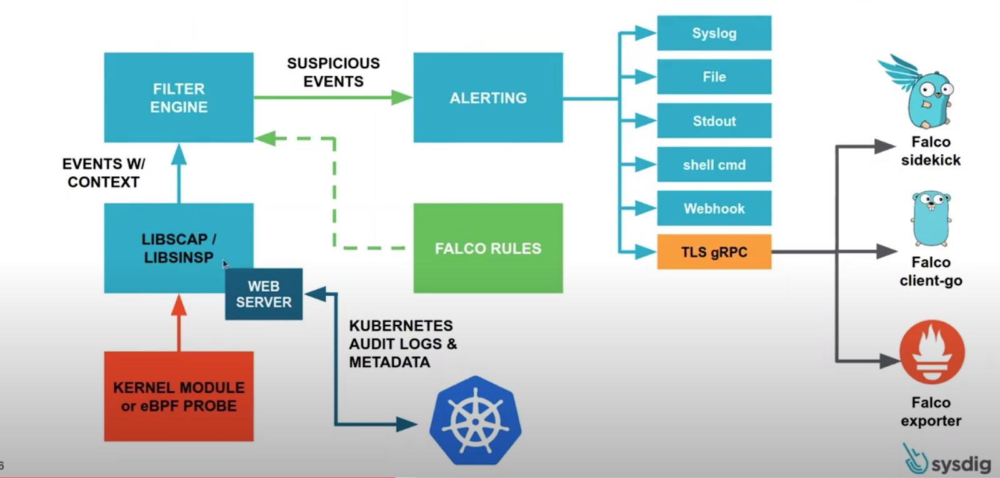
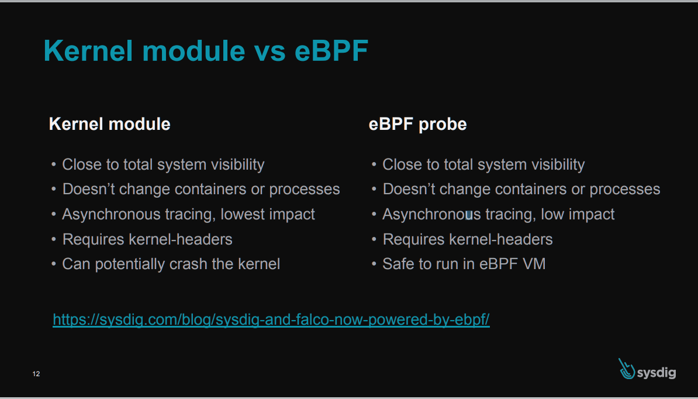

> Credit: https://thenewstack.io/ebpf-tools-an-overview-of-falco-inspektor-gadget-hubble-and-cilium/ <br/>

This repository is made up with two part, in the first part, we will give you a quick introduction about the Falco project then in the second part we will demonstrate how we can add prevention support to the Falco using a technique called "Kubernetes Response Engine".

# A demonstration of usage Container Runtime Security Tool called "Falco"
Enhance Container Runtime Security using the container runtime security tool "Falco."

### Prerequisites
To be able to set up our environment correctly, we need the following tools:
* kubectl v1.20.2
* minikube v1.17.1
* helm v3.5.1

Also, we assume that you have a basic knowledge of the Kubernetes and containers terminology. If you don't have any experience with the Kubernetes and containers, this demo is not for you, so please start with the essentials about the Kubernetes and containers first. After that, once you feel more comfortable with the Kubernetes and containers, try this demo to learn how you can prevent your environment for anomalous activities.

Let's begin by giving a quick introduction about what Falco is and how it works.

### What is Falco?
Falco, the open-source cloud-native runtime security project, is one of the leading open-source Kubernetes threat detection engines. Falco was created by Sysdig in 2016 and is the first runtime security project to join CNCF as an incubation-level project. It monitors anomalous activity in nodes and containers. It can trigger functions to act on this unexpected behavior or report it to appropriate channels.

It does this at the Linux kernel level. Falco works by taking Linux system call information at runtime and rebuilding the kernel state in memory. The Falco engine depends on a driver to consume the raw stream of system call information. Currently, the Falco project supports three different drivers in which the engine can consume this information.

* kernel module
* eBPF probe
* A ptrace(2) userspace program

> For more detail, you can follow the [link.](https://falco.org/blog/choosing-a-driver/)

Rules are the items that Falco asserts against. They are defined in the Falco configuration file and represent the events you can check on the system.

Falco ships with a default set of rules that check the kernel for unusual behavior, such as:

* Privilege escalation using privileged containers
* Namespace changes using tools like setns
* Read/Writes to well-known directories such as /etc, /usr/bin, /usr/sbin, etc
* Creating symlinks

> For more detail, you can follow the [link.](https://falco.org/docs/)

I think we explained some of Falco's essentials, so it's enough to get started with the Falco, so let's move on with the hands-on.

### Hands-On
In this demo, we will use Helm to set up Falco, and there are multiple ways available to set up Falco; if you want to take a look at what those are, you can follow the [link.](https://falco.org/docs/getting-started/installation/)

A quick reminder here, the Helm chart of the Falco uses a "kernel module" driver by default to observe syscall which is made to the kernel, so if you don't specify any override values for the Helm chart to select which driver it uses, it will be using the "kernel module" driver.


> Credit: https://www.cncf.io/wp-content/uploads/2020/08/Kubernetes-Runtime-Security-with-Falco-and-Sysdig.pdf

Let's begin with the starting our Minikube cluster.
```bash
$ minikube start --driver hyperkit
```

Then, add Helm chart repository to your existing repositories.
```bash
$ helm repo add falcosecurity https://falcosecurity.github.io/charts
$ helm repo update
```

Finally, deploy Falco with the defaults to your Minikube cluster.
```bash
$ helm install falco falcosecurity/falco
NAME: falco
LAST DEPLOYED: Sun Jan 31 19:10:49 2021
NAMESPACE: default
STATUS: deployed
REVISION: 1
TEST SUITE: None
NOTES:
Falco agents are spinning up on each node in your cluster. After a few
seconds, they are going to start monitoring your containers looking for
security issues.


No further action should be required.


Tip:
You can easily forward Falco events to Slack, Kafka, AWS Lambda and more with falcosidekick.
Full list of outputs: https://github.com/falcosecurity/charts/falcosidekick.
You can enable its deployment with `--set falcosidekick.enabled=true` or in your values.yaml.
See: https://github.com/falcosecurity/charts/blob/master/falcosidekick/values.yaml for configuration values.

$ FALCO_POD=$(kubectl get pods --selector app=falco -ojsonpath='{range .items[*]}{.metadata.name}{"\n"}')
$ kubectl wait --for=condition=Ready pod/$FALCO_POD --timeout=300s
pod/falco-mkrtf condition met
```

NOTE: We will use the default ruleset which comes with Falco, these rules can be tuned as per your needs in your environment. You can find Falco’s default rules here: https://github.com/falcosecurity/falco/tree/master/rules.

We will test the following Falco rule, it will basically log the intrusion details to standart output when we attach to the container's terminal using exec command:

```yaml
- rule: Terminal shell in container
  desc: A shell was used as the entrypoint/exec point into a container with an attached terminal.
  condition: >
    spawned_process and container
    and shell_procs and proc.tty != 0
    and container_entrypoint
    and not user_expected_terminal_shell_in_container_conditions
  exceptions:
    - name: proc_name_image_suffix
      fields: [proc.name, container.image.repository]
      comps: [in, endswith]
  output: >
    A shell was spawned in a container with an attached terminal (user=%user.name user_loginuid=%user.loginuid %container.info
    shell=%proc.name parent=%proc.pname cmdline=%proc.cmdline terminal=%proc.tty container_id=%container.id image=%container.image.repository)
  priority: NOTICE
  tags: [container, shell, mitre_execution]
```

To test this kind of scanerio, first, we will create a pod called nginx, then, we attach to that pod using "exec", after that once you access the Falco's logs, you should notice that a message above is available within the logs.
```bash
$ kubectl run nginx --image=nginx
pod/nginx created
$ kubectl exec -ti nginx -- sh
#
```

Check the Falco's logs.
```bash
$ kubectl logs -f $FALCO_POD
* Setting up /usr/src links from host
* Running falco-driver-loader with: driver=module, compile=yes, download=yes
* Unloading falco module, if present
* Trying to dkms install falco module with GCC /usr/bin/gcc
DIRECTIVE: MAKE="'/tmp/falco-dkms-make'"
* Running dkms build failed, couldn't find /var/lib/dkms/falco/5c0b863ddade7a45568c0ac97d037422c9efb750/build/make.log (with GCC /usr/bin/gcc)
* Trying to dkms install falco module with GCC /usr/bin/gcc-8
DIRECTIVE: MAKE="'/tmp/falco-dkms-make'"
* Running dkms build failed, couldn't find /var/lib/dkms/falco/5c0b863ddade7a45568c0ac97d037422c9efb750/build/make.log (with GCC /usr/bin/gcc-8)
* Trying to dkms install falco module with GCC /usr/bin/gcc-6
DIRECTIVE: MAKE="'/tmp/falco-dkms-make'"
* Running dkms build failed, couldn't find /var/lib/dkms/falco/5c0b863ddade7a45568c0ac97d037422c9efb750/build/make.log (with GCC /usr/bin/gcc-6)
* Trying to dkms install falco module with GCC /usr/bin/gcc-5
DIRECTIVE: MAKE="'/tmp/falco-dkms-make'"
* Running dkms build failed, couldn't find /var/lib/dkms/falco/5c0b863ddade7a45568c0ac97d037422c9efb750/build/make.log (with GCC /usr/bin/gcc-5)
* Trying to load a system falco driver, if present
* Success: falco module found and loaded with modprobe
Sun Jan 31 16:33:56 2021: Falco version 0.27.0 (driver version 5c0b863ddade7a45568c0ac97d037422c9efb750)
Sun Jan 31 16:33:56 2021: Falco initialized with configuration file /etc/falco/falco.yaml
Sun Jan 31 16:33:56 2021: Loading rules from file /etc/falco/falco_rules.yaml:
Sun Jan 31 16:33:58 2021: Loading rules from file /etc/falco/falco_rules.local.yaml:
Sun Jan 31 16:34:00 2021: Starting internal webserver, listening on port 8765
16:34:42.627002226: Notice A shell was spawned in a container with an attached terminal (user=root user_loginuid=-1 k8s.ns=default k8s.pod=nginx container=a10b72e3e790 shell=sh parent=runc cmdline=sh terminal=34816 container_id=a10b72e3e790 image=nginx) k8s.ns=default k8s.pod=nginx container=a10b72e3e790 --> important here !!
```
